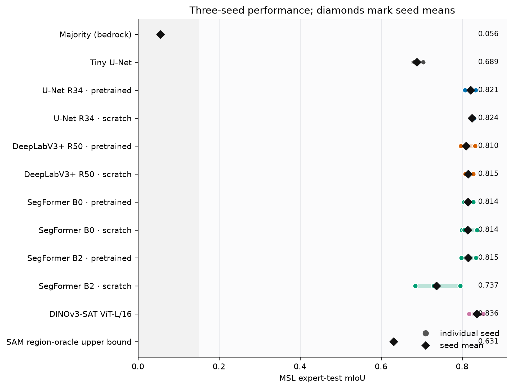
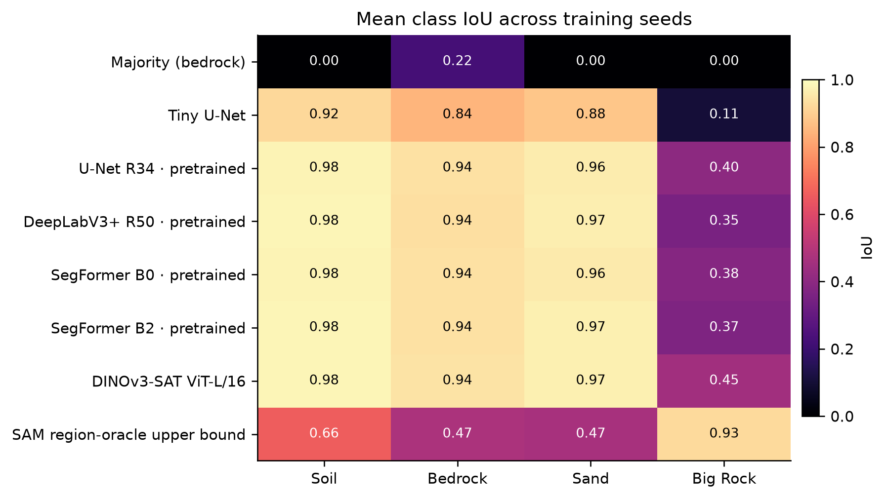
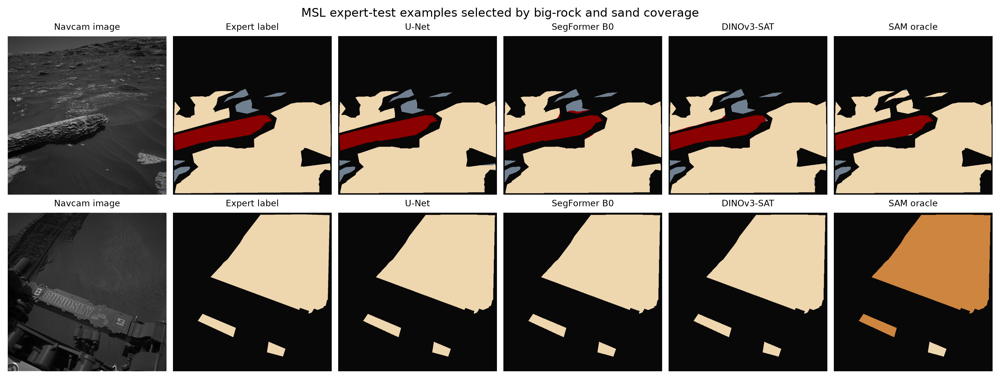
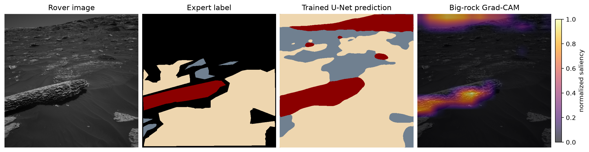
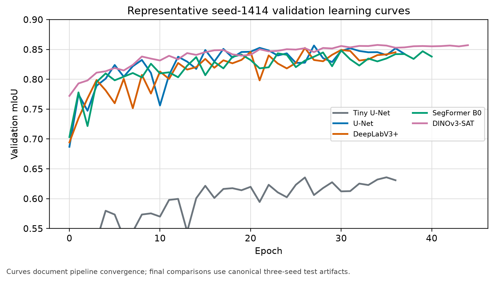

# AresSeg

### Reproducible Mars terrain semantic segmentation on AI4Mars

**AresSeg** is a Python 3.11 research pipeline for four-class semantic segmentation of Mars rover imagery: *soil, bedrock, sand,* and *big rock*. The installable distribution and import package are both named **aresseg**.

The project compares convolutional, transformer, and foundation-model approaches under a preregistered, leakage-safe evaluation protocol. It uses the [AI4Mars merged-0.6 release](https://zenodo.org/records/15995036), keeps ignore-label pixels out of optimization and scoring, and records per-image sufficient statistics for paired inference.

## Final report and results

The completed study contains 30 learned three-seed runs plus the majority and SAM references. The strongest mean Curiosity score is **0.836 mIoU** (DINOv3-SAT); the validation-selected U-Net reaches **0.792 mIoU** on Opportunity/Spirit, a **0.030** cross-rover drop. The sealed analysis supports H1, H4, and H5 and rejects H0, H2, and H3.

- [Final NeurIPS 2026-format report (PDF)](paper/roth_final_neurips.pdf)
- [LaTeX source](paper/roth_final_neurips.tex)
- [Machine-readable hypothesis verdicts](experiments/manifests/verdicts.json)
- [Generated final result summary](paper/generated/final_results.json)

*Mean expert-test mIoU; error bars show the observed range across three seeds for learned systems. SAM is a deterministic label-assisted region-oracle diagnostic, not an ordinary deployable baseline.*

*Per-class performance exposes the persistent big-rock challenge that is hidden by aggregate mIoU.*

*A fixed expert-test scene with substantial big-rock coverage, its expert label, and seed-1414 predictions. Black pixels are ignored. This diagnostic scene was selected for rare-class coverage, not because it maximized a model score.*

## Research protocol

The primary question is whether modern semantic-segmentation systems improve terrain recognition and cross-rover generalization relative to simple and architecture-matched controls. The protocol covers:

- **H1:** learned systems versus a constant-majority reference.
- **H2:** pretrained versus scratch initialization within each tested architecture.
- **H3:** SegFormer MiT-B2 versus U-Net/ResNet-34 and DeepLabV3+/ResNet-50, overall and by class.
- **H4:** Curiosity-to-MER transfer using a bounded mIoU-drop rule and a majority-on-MER reference.
- **H5:** DINOv3-SAT and a SAM region-oracle upper bound versus the learned Tiny U-Net reference.

Implemented model paths include U-Net, DeepLabV3+, SegFormer, Tiny U-Net, and DINOv3-based systems, plus constant-majority and SAM region-oracle references. Evaluation reports overall and per-class IoU, paired image-level bootstrap confidence intervals, preregistered tests with Holm adjustment, and explicit hypothesis verdicts.

See [DEVPLAN.md](DEVPLAN.md) for the authoritative protocol and [docs/DEVLOG.md](docs/DEVLOG.md) for the dated implementation record.

## Model interpretation

*Label-guided Grad-CAM from the trained U-Net decoder for the big-rock class. The heatmap is an interpretability diagnostic: it shows spatial sensitivity for one checkpoint and scene, not causal evidence or a confirmatory result.*

## Training diagnostics

*Representative seed-1414 validation curves demonstrate that optimization, checkpoint selection, and metric logging run end to end. Final hypothesis comparisons require the complete preregistered three-seed inventory.*

## Midpoint deliverables

- [Compiled midpoint paper](paper/roth_midpoint.pdf) and [LaTeX source](paper/roth_midpoint.tex)
- [Rubric-mapped paper outline](paper/midpoint_outline.md)
- [Executed CPU prototype notebook](notebooks/midpoint_prototype.ipynb), including sample masks, class counts, forward passes, metrics, and activation visualization

The notebook stores compact demonstration outputs for inspection, while remaining checkpoint-free for its required CPU prototype path. Optional activation-map cells use an existing local checkpoint when one is available and skip cleanly otherwise.

## Reproducible CPU setup

Clone the renamed repository and create a Python 3.11 environment:

~~~bash
git clone https://github.com/jroth1414/AresSeg.git
cd AresSeg
python3.11 -m venv .venv
.venv/bin/python -m pip install --no-deps -r requirements-cpu.lock.txt
.venv/bin/python -m pip install -r requirements.lock.txt
.venv/bin/python -m pip install --no-deps --no-build-isolation -e .
.venv/bin/python scripts/check_integrity.py
.venv/bin/python scripts/check_env.py
.venv/bin/pre-commit install --install-hooks
~~~

On Windows, use .venv\Scripts\python.exe and .venv\Scripts\pre-commit.exe. CUDA setup and limitations are documented in [docs/REPRODUCIBILITY.md](docs/REPRODUCIBILITY.md).

A minimal import check after installation is:

~~~python
from aresseg.models.zoo import build_model

model = build_model("tiny_unet", num_classes=4)
print(type(model).__name__)
~~~

## Data

Download and validate the merged AI4Mars release before running experiments:

~~~bash
.venv/bin/python scripts/download_data.py --out data/raw/ai4mars --which merged
.venv/bin/python scripts/check_data.py
~~~

The preflight verifies the configured 16,064 MSL training labels, 322 MSL gold-test labels, 204 MER gold-test labels, image/label pairing, split disjointness, label values, and data fingerprints. The merged archive is approximately 16.2 GB with expected MD5 **daf80a86021253292e6c425f97baa5c6**. Raw dataset files, model weights, generated predictions, and secrets remain untracked; the public Zenodo release is cited instead.

## Status and provenance

Training and evaluation are complete: all 30 planned learned runs finished, the cross-rover and reference evaluations are recorded, and the preregistered bootstrap/Holm analysis is sealed under Protocol V5. The final report distinguishes confirmatory results from the exploratory MPBA diagnostic and reports limitations without treating incomplete or exploratory artifacts as evidence.

Historical preregistration snapshots, manifests, and schema identifiers intentionally retain the original **marsseg** namespace so their hashes and provenance remain immutable. New Python code uses **aresseg**; those historical identifiers are not import paths.
